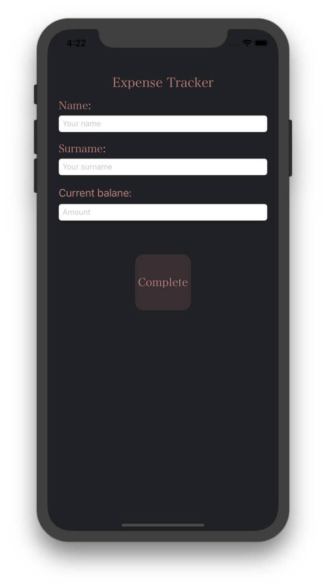
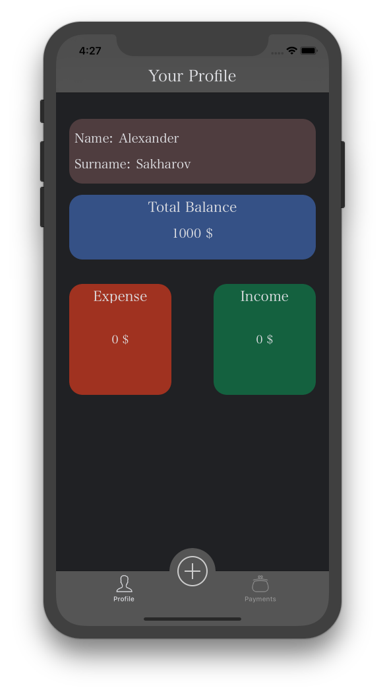
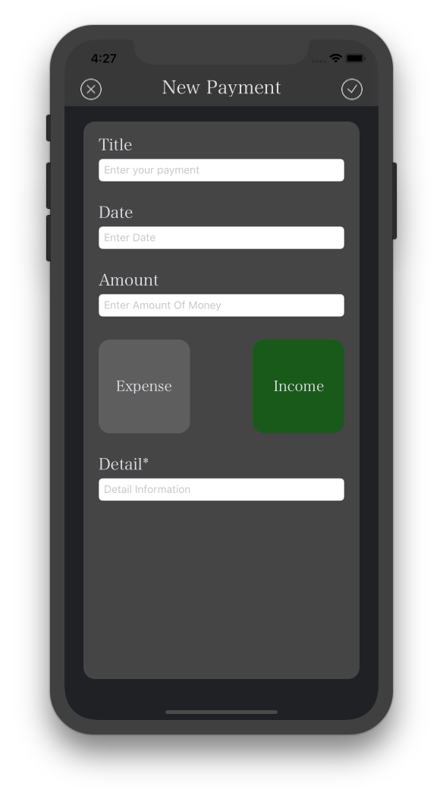
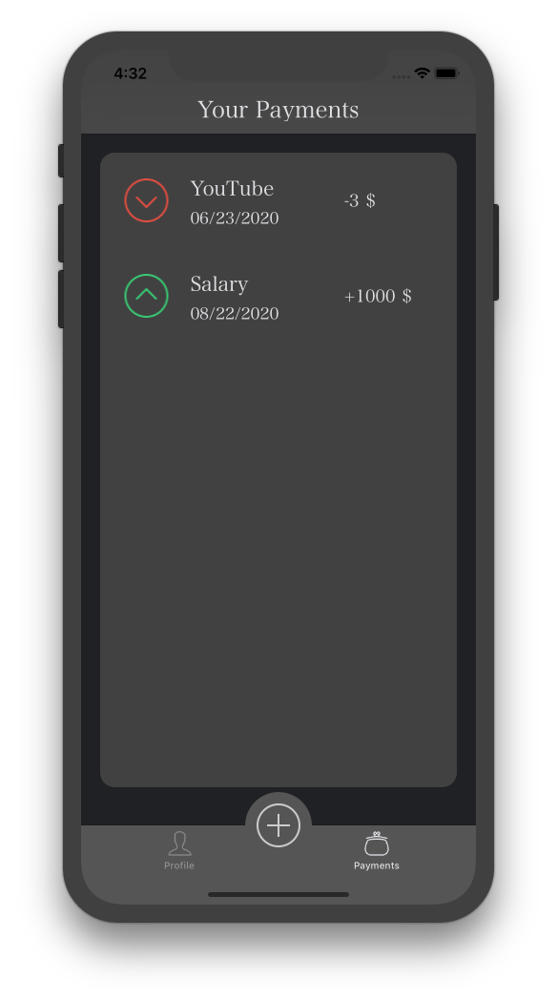

Expense Tracker
=====

### 1.  Tools:

- Core Data

- MVC

### 2. Functions:
- Register

- Add new Payment

### 3. Enviroment:
- Min Xcode version: 10.2

- IOS: 11.1

- Swift: 5
### 4. TODO:

- Add delete payment

- Add sort

- Add Russian localisation

### 5. Screenshots: 

